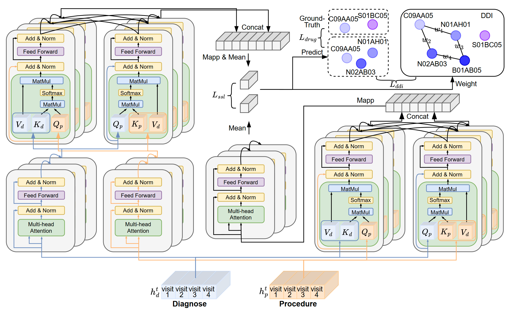

# CD-MDRec
This is the PyTorch implementation for **CD-MDRec** proposed in the paper **Contrastive Deep Fusion-based Diffusion Multi-view Drug Recommendation**.



## 1. Running environment

We develop our codes in the following environment:

- python==3.9.18
- numpy==1.24.3
- torch==1.13.0
- torch-cuda=11.7

## 2. Datasets

| Items               | MIMIC-II | MIMIC-III | MIMIC-IV  |
|---------------------|----------|-----------|-----------|
| # of patients       | 3632     | 5449      | 32633     |
| # of visits         | 9779     | 14141     | 776,766   |
| # of diagnosis      | 20.6     | 33.4      | 105441    |
| # of procedure      | 1247     | 1412      | 8923      |
| # of medication     | 192      | 193       | 199       |
| avg # of visits     | 2.6925   | 2.5952    | 3.2311    |
| avg # of diagnosis  | 31.5896  | 31.6520   | 47.1405   |
| avg # of procedure  | 10.2384  | 9.4601    | 8.0635    |
| avg # of medication | 27.2665  | 29.7427   | 24.6683   |

## 3. Download

1. You must have obtained access to [MIMIC-II](https://physionet.org/content/mimic3-carevue/1.4/), [MIMIC-III](https://physionet.org/content/mimiciii/) and [MIMIC-IV](https://physionet.org/content/mimiciv/) databases before running the code. 

2. Download the MIMIC-II, MIMIC-III and MIMIC-IV datasets, then unzip and put them in the `data` directory. Specifically, you need to download the following files: `DIAGNOSES_ICD.csv`, `PRESCRIPTIONS.csv`, and `PROCEDURES_ICD.csv`.


## 4. How to run the codes

```python9
 python run_mimic2.py
 python run_mimic3.py
 python run_mimic4.py
```
